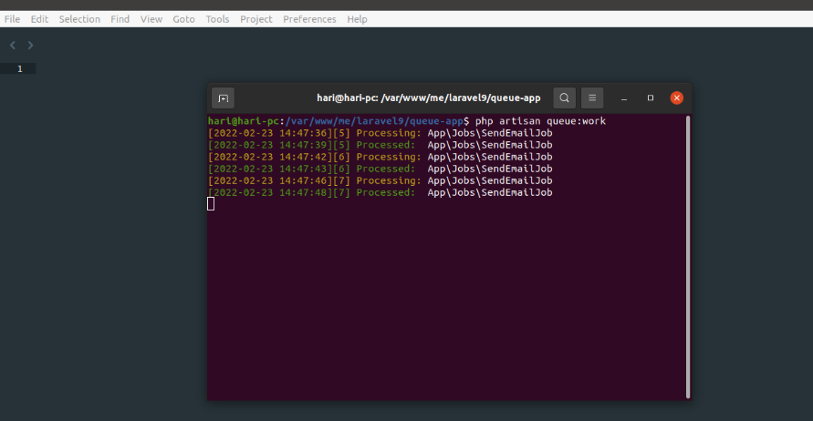
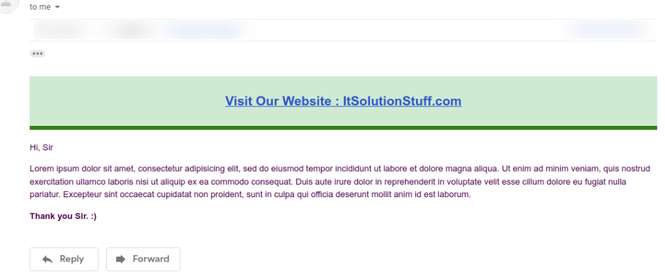

# laravel9_send_email_using_queue
## 1:Install Laravel 9:
```Dockerfile
composer create-project laravel/laravel laravel9_send_email_using_queue
```
## 2: Create Mail Class with Configuration
```Dockerfile
php artisan make:mail SendEmailTest
```
- Vào app/Mail/SendEmailTest.php
```Dockerfile
<?php
  
namespace App\Mail;
  
use Illuminate\Bus\Queueable;
use Illuminate\Contracts\Queue\ShouldQueue;
use Illuminate\Mail\Mailable;
use Illuminate\Queue\SerializesModels;
  
class SendEmailTest extends Mailable
{
    use Queueable, SerializesModels;
  
    /**
     * Create a new message instance.
     *
     * @return void
     */
    public function __construct()
    {
          
    }
    /**
     * Build the message.
     *
     * @return $this
     */
    public function build()
    {
        return $this->view('emails.test');
    }
}
```
- Tạo file resources/views/emails/test.blade.php
```Dockerfile
<!DOCTYPE html>
<html>
<head>
    <title>How to send mail using queue in Laravel 9?  https://github.com/Coder-DLU</title>
</head>
<body>
   
<center>
<h2 style="padding: 23px;background: #b3deb8a1;border-bottom: 6px green solid;">
    <a href="https://itsolutionstuff.com">Visit Our Website : https://github.com/Coder-DLU</a>
</h2>
</center>
  
<p>Hi, Sir</p>
<p>Lorem ipsum dolor sit amet, consectetur adipisicing elit, sed do eiusmod
tempor incididunt ut labore et dolore magna aliqua. Ut enim ad minim veniam,
quis nostrud exercitation ullamco laboris nisi ut aliquip ex ea commodo
consequat. Duis aute irure dolor in reprehenderit in voluptate velit esse
cillum dolore eu fugiat nulla pariatur. Excepteur sint occaecat cupidatat non
proident, sunt in culpa qui officia deserunt mollit anim id est laborum.</p>
  
<strong>Thank you Sir. :)</strong>
  
</body>
</html>
```
- Vào .env
```Dockerfile
MAIL_MAILER=smtp
MAIL_HOST=smtp.gmail.com
MAIL_PORT=465
MAIL_USERNAME=mygoogle@gmail.com
MAIL_PASSWORD=rrnnucvnqlbsl
MAIL_ENCRYPTION=tls
MAIL_FROM_ADDRESS=mygoogle@gmail.com
MAIL_FROM_NAME="${APP_NAME}"
```
## 3:Queue Configuration
- Vào .env
```Dockerfile
QUEUE_CONNECTION=database
```
- Vào Generate Migration:
```Dockerfile
php artisan queue:table
```
- Vào Run Migration:
```Dockerfile
php artisan migrate
```
## 4: Create Queue Job
```Dockerfile
php artisan make:job SendEmailJob
```
- Vào app/Jobs/SendEmailJob.php
```Dockerfile
<?php
  
namespace App\Jobs;
  
use Illuminate\Bus\Queueable;
use Illuminate\Contracts\Queue\ShouldBeUnique;
use Illuminate\Contracts\Queue\ShouldQueue;
use Illuminate\Foundation\Bus\Dispatchable;
use Illuminate\Queue\InteractsWithQueue;
use Illuminate\Queue\SerializesModels;
use App\Mail\SendEmailTest;
use Mail;
  
class SendEmailJob implements ShouldQueue
{
    use Dispatchable, InteractsWithQueue, Queueable, SerializesModels;
  
    protected $details;
  
    /**
     * Create a new job instance.
     *
     * @return void
     */
    public function __construct($details)
    {
        $this->details = $details;
    }
  
    /**
     * Execute the job.
     *
     * @return void
     */
    public function handle()
    {
        $email = new SendEmailTest();
        Mail::to($this->details['email'])->send($email);
    }
}
```
## 5: Test Queue Job
- Vào routes/web.php
```Dockerfile
Route::get('email-test', function(){
  
    $details['email'] = 'your_email@gmail.com';
  
    dispatch(new App\Jobs\SendEmailJob($details));
  
    dd('done');
});
```
- Chạy
```Dockerfile
php artisan queue:work
```


## 6: Run Laravel App:
```Dockerfile
php artisan serve
```
output:
http://localhost:8000/email-test


## 7: Install Supervisor
```Dockerfile
sudo apt-get install supervisor
```
- Vào /etc/supervisor/conf.d/laravel-worker.conf
```Dockerfile
[program:laravel-worker]
process_name=%(program_name)s_%(process_num)02d
command=php /home/forge/app.com/artisan queue:work sqs --sleep=3 --tries=3 --max-time=3600
autostart=true
autorestart=true
stopasgroup=true
killasgroup=true
user=forge
numprocs=8
redirect_stderr=true
stdout_logfile=/home/forge/app.com/worker.log
stopwaitsecs=3600
```
- Chạy lại 
```Dockerfile
sudo supervisorctl reread
```
```Dockerfile
sudo supervisorctl update
```
```Dockerfile
sudo supervisorctl start laravel-worker:*
```


